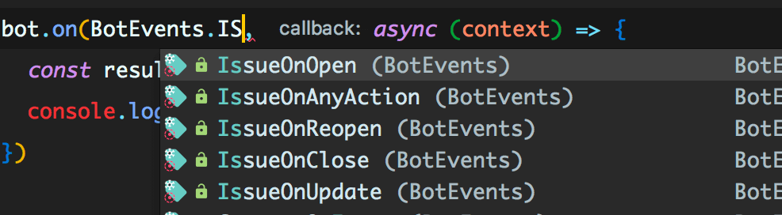
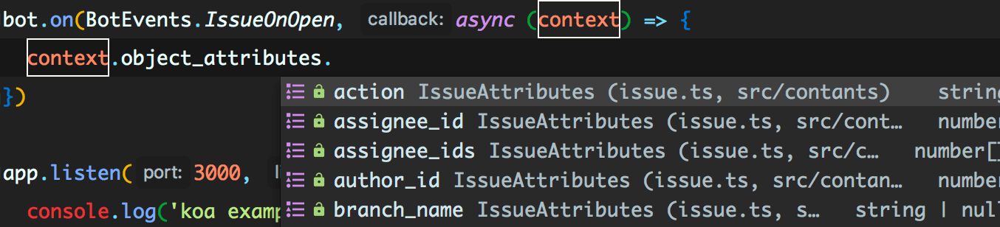

## cobot

A user-experience-focused middleware for building Gitlab applications. [more examples](https://github.com/wittbulter/cobot/blob/master/examples/).

Support frameworks: [Express](https://github.com/expressjs/express) / [Koa](https://github.com/koajs/koa).

<br/>

### Why cobot?

- NO APIS

- Friendly user experience design

- Include `.d.ts`, support for automatic completion in editor.

- Semantic actions.

<br/>

### How to use

1. install robot: `yarn add cobot` or `npm i cobot`.

2. import to your nodejs server:

```ts
// express
import cobot, { BotEvents } from 'cobot'
app.use(cobot.express())

// koa2
app.use(cobot.koa())
```

3. set webhook on gitlab: `Settings > integrations > url('http://{yourhost}/{any}') > Add webhook`. you can fill in any api with your nodjes server, robot automatically identifies requests from webhooks.

<br/>

### Example

#### 1. Print `ok` when webhook is triggered.
```ts
const bot = cobot.lift()
bot.on(BotEvents.MergeRequest, context => console.log('ok'))
```

#### 2. Reply `thanks your issue` when a new issue opened.

```ts
const bot = cobot.lift()
bot.on(BotEvents.IssueOnOpen, context => {
  context.actions.reply('thanks your issue')
})
```

#### 3. Use await/async in callback

```ts
const bot = cobot.lift()
bot.on(BotEvents.MergeRequest, async(context) => {
  const notes = await context.actions.findNotes()
  console.log(notes)
})
```

#### 4. Don't worry about interfaces and methods




<br/>

### Support events

```ts
BotEvents = [
  'CommentOnIssue',
  'CommentOnCommit',
  'CommentOnSnippet',
  'CommentOnMergeRequest',
  'MergeRequest',
  'WikiCreate',
  'WikiUpdate',
  'WikiDelete',
  'WikiOnAnyAction',
  'PipelineOnRunning',
  'PipelineOnPending',
  'PipelineOnSuccess',
  'PipelineOnFailed',
  'PipelineOnCanceled',
  'PipelineOnSkipped',
  'PipelineOnAnyStatus',
  'BuildOnAnyStatus',
  'Push',
  'Tag',
  'IssueOnAnyAction',
  'IssueOnOpen',
  'IssueOnUpdate',
  'IssueOnClose',
  'IssueOnReopen',
]
```

<br/>

### LICENSE

[MIT](LICENSE)

